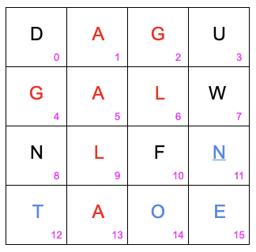

# Boggle Challenge

## What is Boggle?
[From wikipedia](https://en.wikipedia.org/wiki/Boggle):
``Boggle is a word game ... originally distributed by Parker
Brothers. The game is played using a plastic grid of lettered dice, in which
players attempt to find words in sequences of adjacent letters.``

Boggle has the following rules:
1. Words must be constructed from letters of sequentially adjacent cubes, where
   "adjacent" cubes are those horizontally, vertically, and diagonally
   neighboring.
2. The same cube may not be used more than once per word.
3. Words must be at least three letters long.
4. Words must be unique (i.e. if a word can be found twice in a board, only one
   of the entries is valid.)
5. All words must be found in a previously nominated dictionary.
6. All words must be found within 3 minutes, with time measured by a timer.

(thank you wikipedia, for being a wonderful resource for these rules.)

## Example

In the above example we can see these rules in action. For instance the words
`of` _(14, 10)_, `at` _(12, 13)_, `an` _(13, 8)_, etc are not valid for the game
because they don't have at least three letters. The word `tone` _(12, 14, 11, 15)_ is not
valid because positions 12 and 14 are not adjacent. The word `none` _(11, 14,
11, 15)_ is not valid because it uses the 11th position twice. There are several
valid words like `all`, `tall`, `fall`, `lag`, `gallon`, `one`, etc. `lag` is
interesting in that it can be made 6 different ways, but it is only valid
once _(6, 5, 4; 6, 1, 4; 6, 1, 2; 6, 5, 2; 9, 5, 2; 9, 5, 4)_.

## Challenge Overview
In order to pass this challenge, you must develop software that will take a
string input that represents a Boggle puzzle, and return all valid word entries
found in that puzzle within the given time period.

## Challenge Rules
Submissions must come in the form of a public git repository, with all contents
under the MIT license. The language used can be of your choice, but must be
open source, so that it can be run without purchasing a language license. We
will review your code for completeness, coding style, etc. Repository will be
pulled, built, and run to test the validity of code.

## Challenge Details
This repository contains the Dictionary file that is to be used, along with
multiple puzzle and solution examples in the puzzles directory. We will use
these to test your code for accuracy.
